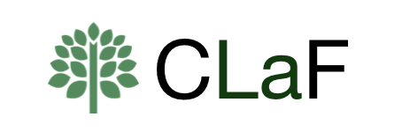
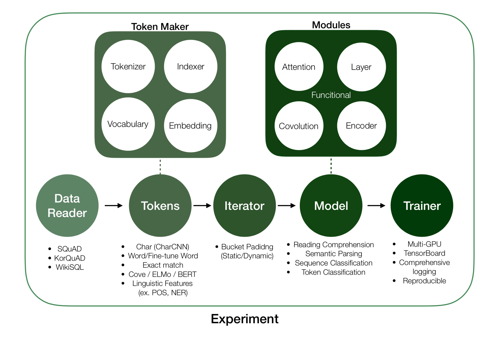
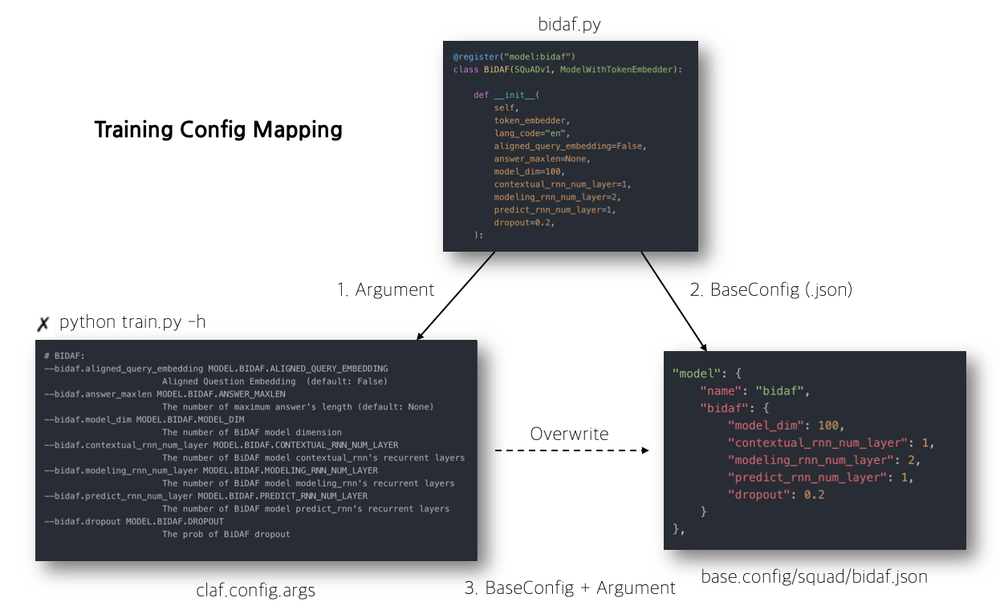
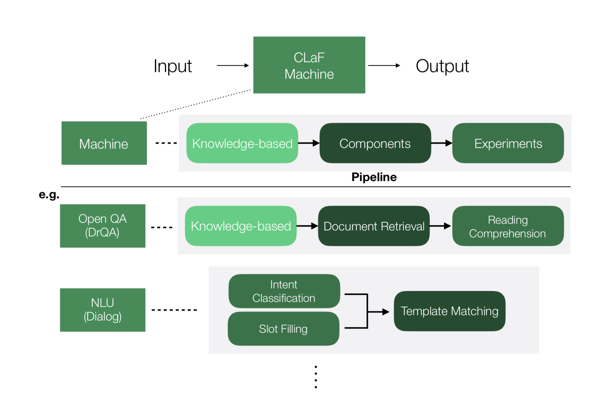

<p align="center">
    
</p>

<h4 align="center">Clova Language Framework</h4>

<p align="center">
    <a href="https://pages.oss.navercorp.com/ClovaAI-PJT/reasoning-qa/">
        
    </a>
    <a href="https://github.com/ambv/black">
        
    </a>
        <a href="https://github.com/pytest-dev/pytest-cov">
        
    </a>
</p>

---

# CLaF: Clova Language Framework

**CLaF** is a Language Framework built on PyTorch that provides following two high-level features:

- `Experiment` enables the control of training flow in general NLP by offering various `TokenMaker` methods. 
    - CLaF is inspired by the designe principle of [AllenNLP](https://github.com/allenai/allennlp) such as the higher level concepts and reusable code, but mostly based on PyTorch’s common module, so that user can easily modify the code on their demands.  
- `Machine` helps to combine various modules to build a NLP Machine in one place.
    - There are knowledge-based, components and trained experiments which infer 1-example in modules.

## Table of Contents

- [Installation](#installation) 
    - [Requirements](#requirements)
    - [Install via pip](#install-via-pip)
- [Overview](#overview)
- [Experiment](#experiment)
	- [Features](#features)
	- [Usage](#usage)
	    - [Training](#training) 
	    - [Evaluate](#evaluate) 
	    - [Predict](#predict) 
	    - [Docker Images](#docker-images)
- [Machine](#machine)
- [Contributing](#contributing)
- [Maintainers](#maintainers)
- [License](#license)


## Installation

### Requirements

- Python 3.6
- PyTorch >= 0.4.1
- [MeCab](https://bitbucket.org/eunjeon/mecab-ko) for Korean Tokenizer
    - ```sh script/install_mecab.sh```

It is recommended to use the virtual environment.  
[Conda](https://conda.io/docs/download.html) is the easiest way to set up a virtual environment.

```
conda create -n claf python=3.6
conda activate claf

(claf) ✗ pip install -r requirements.txt
```

### Install via pip

Commands to install via pip 

```
pip install claf
```

## Overview

- **Multilingual** modeling support (currently, English and Korean are supported).
- Light weighted **Systemization** and Modularization.
- Easy extension and implementation of models.
- A wide variation of **Experiments** with reproducible and comprehensive logging
- The metrics for services such as "1\-example inference latency" are provided.
- Easy to build of a NLP **Machine** by combining modules.

## Experiment

- Training Flow




### Features

- [Full Documentation](https://pages.oss.navercorp.com/ClovaAI-PJT/reasoning-qa/)
- [Dataset And Model](https://pages.oss.navercorp.com/ClovaAI-PJT/reasoning-qa/docs/_build/html/contents/dataset_and_model.html)
- [Pretrained Vector](https://pages.oss.navercorp.com/ClovaAI-PJT/reasoning-qa/docs/_build/html/contents/pretrained_vector.html)
- [Tokens](https://pages.oss.navercorp.com/ClovaAI-PJT/reasoning-qa/docs/_build/html/contents/tokens.html)

---


### Usage

#### Training




1. only Arguments

	```
	python train.py --train_file_path {file_path} --valid_file_path {file_path} --model_name {name} ...
	```

2. only BaseConfig (skip `/base_config` path)

	```
	python train.py --base_config {base_config}
	```
	
3. BaseConfig + Arguments

	```
	python train.py --base_config {base_config} --learning_rate 0.002
	```
	
	- Load BaseConfig then overwrite `learning_rate` to 0.002


#### BaseConfig

Declarative experiment config (.json)

- Simply matching with object's parameters
- Exists samples in `/base_config` directory

```
Base Config:
  --base_config BASE_CONFIG
    Use pre-defined base_config:

    * SQuAD:
    ['squad/bert_large_uncased', 'squad/bidaf', 'squad/drqa_paper', 'squad/drqa', 'squad/bert_base_uncased', 'squad/qanet', 'squad/docqa+elmo', 'squad/bidaf_no_answer', 'squad/docqa_no_answer', 'squad/qanet_paper', 'squad/bidaf+elmo', 'squad/docqa']

    * KorQuAD:
    ['korquad/bidaf', 'korquad/docqa']

    * WikiSQL:
    ['wikisql/sqlnet']
    
    * CoLA:
    ['cola/bert_large_uncased', 'cola/structured_self_attention']

    * CoNLL 2003:
    ['conll2003/bert_large_cased']
```

#### Evaluate

```
python eval.py <data_path> <model_checkpoint_path>
```

- Example

```
✗ python eval.py data/squad/dev-v1.1.json logs/squad/bidaf/checkpoint/model_19.pkl
...
[INFO] - {
    "valid/loss": 2.59111491665019,
    "valid/epoch_time": 60.7434446811676,
    "valid/start_acc": 63.17880794701987,
    "valid/end_acc": 67.19016083254493,
    "valid/span_acc": 54.45600756859035,
    "valid/em": 68.10785241248817,
    "valid/f1": 77.77963381714842
}
# write predictions files (<log_dir>/predictions/predictions-valid-19.json)
```

- 1-example Inference Latency ([Summary](docs/_build/html/reports/summary.html))

```
✗ python eval.py data/squad/dev-v1.1.json logs/squad/bidaf/checkpoint/model_19.pkl
...
# Evaluate Inference Latency Mode.
...
[INFO] - saved inference_latency results. bidaf-cpu.json  # file_format: {model_name}-{env}.json
```

#### Predict

```
python predict.py <model_checkpoint_path> --<arguments>
```

- Example

```
✗ python predict.py logs/squad/bidaf/checkpoint/model_19.pkl \
    --question "When was the last Super Bowl in California?" \
    --context "On May 21, 2013, NFL owners at their spring meetings in Boston voted and awarded the game to Levi's Stadium. The $1.2 billion stadium opened in 2014. It is the first Super Bowl held in the San Francisco Bay Area since Super Bowl XIX in 1985, and the first in California since Super Bowl XXXVII took place in San Diego in 2003."

>>> Predict: {'text': '2003', 'score': 4.1640071868896484}
```

---


### Machine

- Machine Architecture




#### Usage

- Define the config file (.json) like [BaseConfig](#baseconfig) in `machine_config/` directory
- Run CLaF Machine (skip `/machine_config` path)


```
✗ python machine.py --machine_config {machine_config}
```


* The list of pre-defined `Machine`:

```
Machine Config:
  --machine_config MACHINE_CONFIG
    Use pre-defined machine_config (.json (.json))

    ['ko_wiki', 'nlu']
```

#### Open QA (DrQA)

DrQA is a system for reading comprehension applied to open-domain question answering. The system has to combine the challenges of document retrieval (finding the relevant documents) with that of machine comprehension of text (identifying the answers from those documents).

- ko_wiki: Korean Wiki Version

``` 
✗ python machine.py --machine_config ko_wiki
...
Completed!
Question > 동학의 2대 교주 이름은?
--------------------------------------------------
Doc Scores:
 - 교주 : 0.5347289443016052
 - 이교주 : 0.4967213571071625
 - 교주도 : 0.49036136269569397
 - 동학 : 0.4800325632095337
 - 동학중학교 : 0.4352934956550598
--------------------------------------------------
Answer: [
    {
        "text": "최시형",
        "score": 11.073444366455078
    },
    {
        "text": "충주목",
        "score": 9.443866729736328
    },
    {
        "text": "반월동",
        "score": 9.37778091430664
    },
    {
        "text": "환조 이자춘",
        "score": 4.64817476272583
    },
    {
        "text": "합포군",
        "score": 3.3186707496643066
    }
]
```

#### NLU (Dialog)

The reason why NLU machine does not return the full response is that response generation may require various task-specific post-processing techniques or additional logic(e.g. API calls, template-decision rules, template filling rules, nn-based response generation model) Therefore, for flexible usage, NLU machine returns only the NLU result.

``` 
✗ python machine.py --machine_config nlu
...
Utterance > "looking for a flight from Boston to Seoul or Incheon"

NLU Result: {
    "intent": "flight",
    "slots": {
        "city.depart": ["Boston"],
        "city.dest": ["Seoul", "Incheon"]
    }
}
```


## Contributing

Thanks for your interest in contributing! There are many ways to contribute to this project.  
Get started [here](./CONTRIBUTING.md).

## Maintainers

CLaF is currently maintained by 

- [Dongjun Lee](https://github.com/DongjunLee) (Author)
- [Sohee Yang](https://github.com/soheeyang)
- [Minjeong Kim](https://github.com/Mjkim88)

## Acknowledgements

`docs/` directory which includes documentation created by [Sphinx](http://www.sphinx-doc.org/).

## License

MIT license

```
Copyright (c) 2019-present NAVER Corp.

Permission is hereby granted, free of charge, to any person obtaining a copy 
of this software and associated documentation files (the "Software"), to deal 
in the Software without restriction, including without limitation the rights 
to use, copy, modify, merge, publish, distribute, sublicense, and/or sell 
copies of the Software, and to permit persons to whom the Software is 
furnished to do so, subject to the following conditions:

The above copyright notice and this permission notice shall be included in all 
copies or substantial portions of the Software.

THE SOFTWARE IS PROVIDED "AS IS", WITHOUT WARRANTY OF ANY KIND, EXPRESS OR 
IMPLIED, INCLUDING BUT NOT LIMITED TO THE WARRANTIES OF MERCHANTABILITY, 
FITNESS FOR A PARTICULAR PURPOSE AND NONINFRINGEMENT. IN NO EVENT SHALL THE 
AUTHORS OR COPYRIGHT HOLDERS BE LIABLE FOR ANY CLAIM, DAMAGES OR OTHER 
LIABILITY, WHETHER IN AN ACTION OF CONTRACT, TORT OR OTHERWISE, ARISING FROM, 
OUT OF OR IN CONNECTION WITH THE SOFTWARE OR THE USE OR OTHER DEALINGS IN THE 
SOFTWARE.
```


